# Chapter 2 (Week 1)

## Exercise 2.1 - Plotting in Matlab

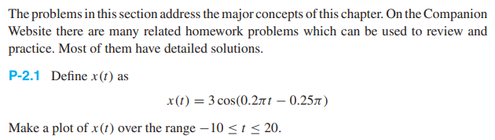

```matlab
clear
syms t
x = 3 * cos(0.2 * pi * t - 0.25 * pi)
fplot(x, [-10, 20])
```

## Exercise 2.4 - (Skipped)

## Exercise 2.5 - Phasor Form

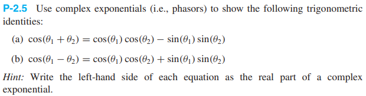

**a) Calculations In Phasor Form**

$$\cos(\theta_1 +\theta_2)$$ 

$$= \Re\{\cos(\theta_1 + \theta_2) + j\sin(\theta_1 + \theta_2)\}$$ 

$$= \Re\{e^{j(\theta_1 + \theta_2)}\}$$

$$=\Re\{e^{j\theta_1 + j\theta_2}\}$$

$$=\Re\{e^{j\theta_1}e^{j\theta_2}\}$$

$$=\Re\{(\cos(\theta_1)+j\sin(\theta_1))(\cos(\theta_2)+j\sin(\theta_2))\}$$

$$=\Re\{\cos(\theta_1)\cos(\theta_2)+j^2\sin(\theta_1)\sin(\theta_2)+j\cos(\theta_1)\sin(\theta_2)+j\sin(\theta_1)\cos(\theta_2)\}$$

$$=\Re\{\cos(\theta_1)\cos(\theta_2)-\sin(\theta_1)\sin(\theta_2)+j\cos(\theta_1)\sin(\theta_2)+j\sin(\theta_1)\cos(\theta_2)\}$$

$$=\cos(\theta_1)\cos(\theta_2)-\sin(\theta_1)\sin(\theta_2)$$

QED

**b) (Skipped)**

## Exercise 2.7 - Complex Number Arithmetic

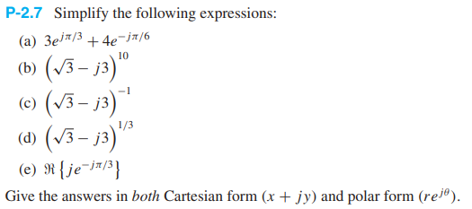

**a)**

```matlab
clear
a = 3*exp(j * pi / 3) + 4 * exp(-j * pi / 6)
[theta, r] = cart2pol(real(a), imag(a))
% a = 4.9641 + 0.5981i
% theta = 0.1199
% r = 5.0000
```

Cartesian form:

$4.9641 + j0.5981$

Polar form:

$5e^{j0.1199}$

**b)**

```matlab
clear
b = (sqrt(3) - j*3)^10
[theta, r] = cart2pol(real(b), imag(b))
% b = -1.2442e+05 + 2.1549e+05i
% theta = 2.0944
% r = 248832
```

Skipped the rest cause it's the same.

## Exercise 2.11 - TODO

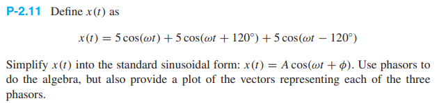

## Exercise 2.17 - TODO

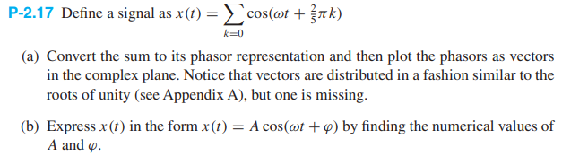

## Exercise 2.20 - TODO

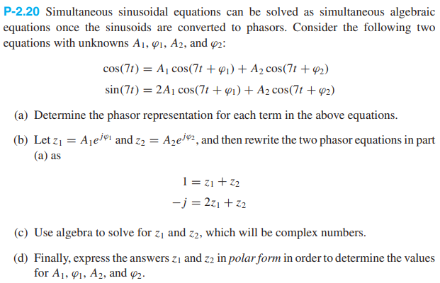

## Exercise 2.24 - TODO

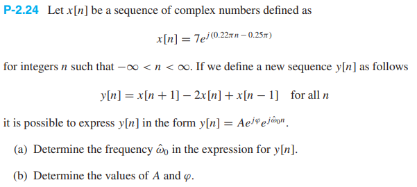


# Chapter 3 (Week 2)

## Exercise 3.1 - Reading Spectrum Representation

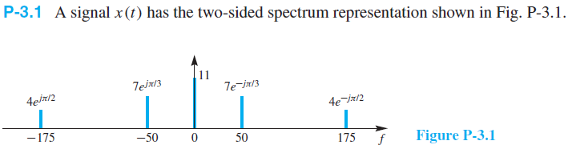


**a)**

$x(t) = 11 + 14\cos(100\pi-\pi/3)+8\cos(350\pi-\pi/2)$

**b)**

Yes. Its fundamental frequency is the greatest common divisor between the frequencies of the two cosines. Then you take the reciprocal.

```matlab
clear
gcd(50, 175)
% 25
```

**c)**

Because otherwise the signal would be complex, and that doesn't make sense for real signals.

## Exercise 3.3 - Standard Form to Spectrum Form

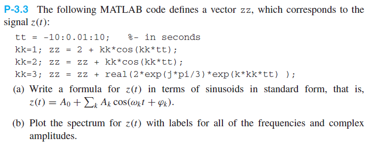

**a)**

$z(t) = 2 + \cos(t) + 2\cos(2 t) + \Re\{2 e^{j\pi/3} e^{j3t}\}$

$z(t)=2+\cos(t)+2\cos(2t)+2\cos(3t+\pi/3)$

**b)**

Bruh I don't feel like it.

## Exercise 3.4 -

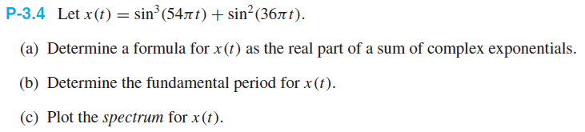


## Exercise 3.9 -

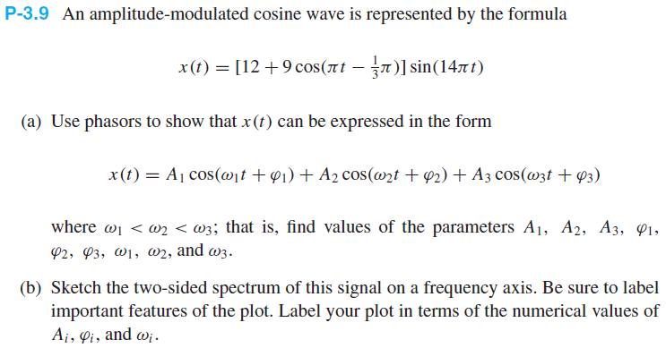

## Exercise 3.13 -

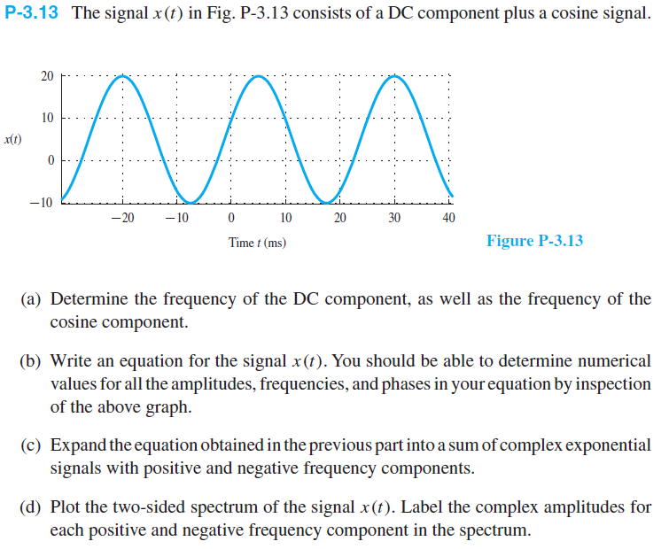

## Exercise 3.16 -

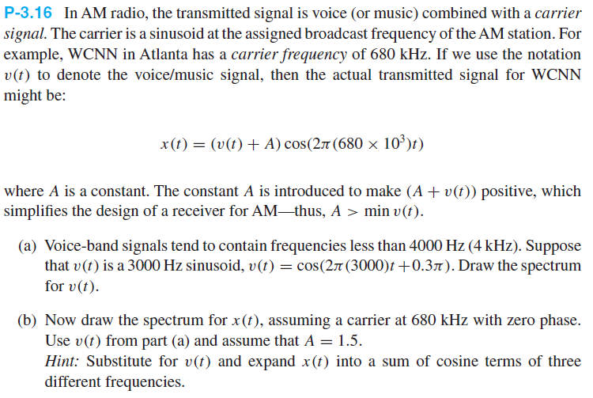

## Exercise 3.24 -

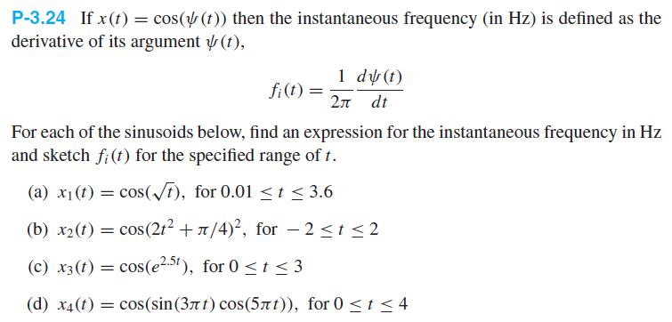

# Chapter 4 (Week 3)

