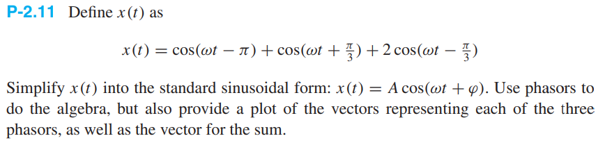
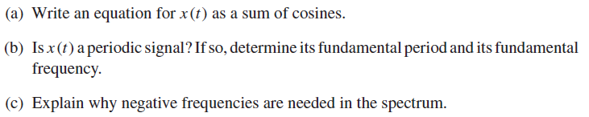

# Chapter 2 (Week 1)

## Exercise 2.1 - Plotting in Matlab


```matlab
clear
syms t
x = 3 * cos(0.2 * pi * t - 0.25 * pi)
fplot(x, [-10, 20])
```

## Exercise 2.4 - (Skipped)

## Exercise 2.5 - Phasor Form


**a) Calculations In Phasor Form**

$$\cos(\theta_1 +\theta_2)$$ 

$$= \Re\{\cos(\theta_1 + \theta_2) + j\sin(\theta_1 + \theta_2)\}$$ 

$$= \Re\{e^{j(\theta_1 + \theta_2)}\}$$

$$=\Re\{e^{j\theta_1 + j\theta_2}\}$$

$$=\Re\{e^{j\theta_1}e^{j\theta_2}\}$$

$$=\Re\{(\cos(\theta_1)+j\sin(\theta_1))(\cos(\theta_2)+j\sin(\theta_2))\}$$

$$=\Re\{\cos(\theta_1)\cos(\theta_2)+j^2\sin(\theta_1)\sin(\theta_2)+j\cos(\theta_1)\sin(\theta_2)+j\sin(\theta_1)\cos(\theta_2)\}$$

$$=\Re\{\cos(\theta_1)\cos(\theta_2)-\sin(\theta_1)\sin(\theta_2)+j\cos(\theta_1)\sin(\theta_2)+j\sin(\theta_1)\cos(\theta_2)\}$$

$$=\cos(\theta_1)\cos(\theta_2)-\sin(\theta_1)\sin(\theta_2)$$

QED

**b) (Skipped)**

## Exercise 2.7 - Complex Number Arithmetic


**a)**

```matlab
clear
a = 3*exp(j * pi / 3) + 4 * exp(-j * pi / 6)
[theta, r] = cart2pol(real(a), imag(a))
% a = 4.9641 + 0.5981i
% theta = 0.1199
% r = 5.0000
```

Cartesian form:

$4.9641 + j0.5981$

Polar form:

$5e^{j0.1199}$

**b)**

```matlab
clear
b = (sqrt(3) - j*3)^10
[theta, r] = cart2pol(real(b), imag(b))
% b = -1.2442e+05 + 2.1549e+05i
% theta = 2.0944
% r = 248832
```

Skipped the rest cause it's the same.

## Exercise 2.11 - Sum of Sinusoids of Same Frequency



Rewrite into exponential form and factor out $e^{j\omega t}$ frequency component to get the three phase and amplitude phasors without any variables.

$x(t)=\Re\{(e^{-j\pi}+e^{j\pi/3}+2e^{-j\pi/3})e^{j\omega t}\}$

Now I write each of the three phasors in cartesian form:

* $e^{j\pi}\to \cos(\pi)+j\sin(\pi)=-1+j0$
* $e^{j\pi/3}\to\cos(\pi/3)+j\sin(\pi/3)=\frac{1}{2}+j\frac{\sqrt{3}}{2}$
* $2e^{-j\pi/3}\to2\cos(-\pi/3)+j2\sin(-\pi/3)=1-j\sqrt{3}$

Now we add everything together and simplify:

$x(t)=\Re\{(\frac{1}{2}-j\frac{\sqrt{3}}{2})e^{j\omega t}\}$

Now we need to get it back into standard sinusoid form, so we need to rewrite the phasor in polar form, and multiply the frequency component back on:

$\varphi = \angle X = \operatorname{atan}\left(\dfrac{-\sqrt 3/2}{1/2}\right)=-\pi/3$

$A=|X|=\sqrt{\left(-\sqrt 3/2\right)^2+\left(1/2\right)^2}=1$

$x(t)=\Re\{e^{-j\pi/3}e^{j\omega t}\}$

Now we can finally get the standard sinusoid form:

$x(t)=\cos(\omega t - \pi/3)$

**Note:** if you are feeling adventurous you can bypass the exponential form entirely, by doing some steps in your head.

## Exercise 2.17 - TODO


## Exercise 2.20 - TODO


## Exercise 2.24 - TODO


# Chapter 3 (Week 2)

## Exercise 3.1 - Reading Spectrum Representation




**a)**

$x(t) = 11 + 14\cos(100\pi-\pi/3)+8\cos(350\pi-\pi/2)$

**b)**

Yes. Its fundamental frequency is the greatest common divisor between the frequencies of the two cosines. Then you take the reciprocal.

```matlab
clear
gcd(50, 175)
% 25
```

**c)**

Because otherwise the signal would be complex, and that doesn't make sense for real signals.

## Exercise 3.3 - Standard Form to Spectrum Form


**a)**

$z(t) = 2 + \cos(t) + 2\cos(2 t) + \Re\{2 e^{j\pi/3} e^{j3t}\}$

$z(t)=2+\cos(t)+2\cos(2t)+2\cos(3t+\pi/3)$

**b)**

Bruh I don't feel like it.

## Exercise 3.4 - TODO


## Exercise 3.9 - TODO


## Exercise 3.13 - TODO


## Exercise 3.16 - TODO


## Exercise 3.24 - TODO


# Chapter 4 (Week 3)

## Exercise 4.1 -


## Exercise 4.8 -

## Exercise 4.12 -

## Exercise 4.15 -

## Exercise 4.17 -

# Chapter 5 (Week 4) - 

## Exercise 5.1 -

## Exercise 5.4 -

## Exercise 5.6 -

## Exercise 5.7 -

## Exercise 5.13 -

## Exercise 5.18 -

# Chapter 6 (Week 5) -

## Exercise 6.2 -

## Exercise 6.6 -

## Exercise 6.7 -

## Exercise 6.13 -

## Exercise 6.19 -

## Exercise 6.23 -

# Chapter 7 (Week 6) -

## Exercise 7.1 -

## Exercise 7.2 -

## Exercise 7.8 -

## Exercise 7.11 -

# Chapter 8 (Week 7) -

## Exercise 8.1 -

## Exercise 8.2 -

## Exercise 8.8 -

# Chapter 9 (Week 8) -

## Exercise 9.1 -

## Exercise 9.3 -

## Exercise 9.4 -

## Exercise 9.6 -

## Exercise 9.14 -

# Chapter 10 (Week 9, 10) -

## Exercise 10.1 -

## Exercise 10.2 -

## Exercise 10.3 -

## Exercise 10.5 -

## Exercise 10.6 -

## Exercise 10.7 -

## Exercise 10.8 -

## Exercise 10.9 -

## Exercise 10.11.3 -

## Exercise 10.11.4 -

## Exercise 10.11.5 -

## Exercise 10.12 -

