[TOC]

# 1. Sinusoids

$$x(t) = A\cdot\cos(\omega_0 t + \varphi) = A\cos(2\pi f_0 t + \varphi)$$

where:

* $$A$$ is amplitude
* $\varphi$ is phase shift, is in radians, not seconds, i.e. time shift relative to the frequency.
* $\omega_0$ is the radian frequency (radians per second)
* $f_0 = \omega_0/(2 \pi)$ is the cyclic frequency (normal nice intuitive frequency)

## Period vs. Frequency

$$T_0=\dfrac{1}{f_0}=\dfrac{2\pi}{\omega_0}$$

Where $T_0$ is the *period* of the oscillation, i.e. how long it takes for a single cycle of oscillation, start to finish, whereas $f_0$ is how many oscillations per second.

## Time-Shift vs. Phase-Shift

Phase shift is relative to frequency and is in radians, time shift is absolute and is in seconds.

$$x(t - t_0) = A\cdot\cos(\omega_0 (t - t_0) + \varphi)$$

Where:

* $t_0$: time shift
* $\varphi$: phase shift
* Everything else explained above

## Complex Exponential Form

Complex exponentials are basically vectors that spin around the origin. The x and y coordinates are a sine and cosine function, so sinusoids can be re-written as complex exponentials.

$$A e^{j(\omega_0 t+\varphi)} = A\cos(\omega_0 t + \varphi) + jA\sin(\omega_0 t + \varphi)$$

$$\Re\{A e^{j(\omega_0 t+\varphi)}\} = A\cos(\omega_0 t + \varphi)$$

### Regneregler

$$\cos\theta = \dfrac{e^{j\theta} + e^{-j\theta}}{2}$$

$$\sin\theta =\dfrac{e^{j\theta}-e^{-j\theta}}{2j}$$

Sum of sinusoids with the same frequency, but different phases or amplitudes, is a new sinusoid with the same frequency but different amplitude and phase.

$$\cos(...) + \cos(...) + ...$$ (where they have the same frequency but not the same amplitude or phase)

$$\sum A_ke^{j\phi_k} = Ae^{j\phi}$$

$$\Re\{Ae^{j\phi}e^{j\omega_0 t}\}=\cos(...)$$

If you need to sum a bunch of sinusoids that have the same frequency, just transform them to polar form, add them together, multiply the result by $e^{j\omega_0 t}$ and take the real part and that's the sum.

# 2. Spectrum Representation

Sum of sinusoids, where amplitude, phase and frequency can all freely be changed, can theoretically represent any continuous signal (but might require an infinite sum).

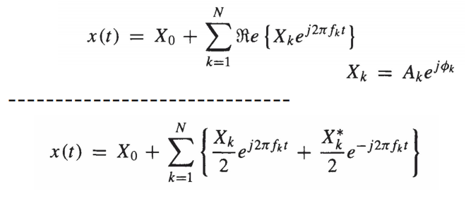

Taking the real component of a sum of complex exponentials, is the same as adding the complex conjugates of each term to the terms, which cancels out the imaginary part. This means that the spectrum has a mirrored negative frequency side which is derived from the complex conjugates.

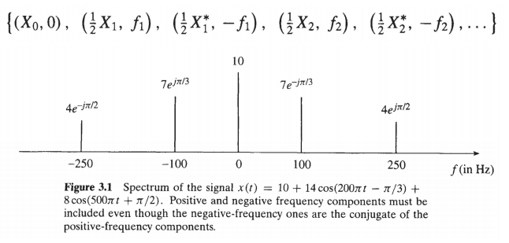

**To solve exercises:** re-write whatever function you have to find the spectrum of into a sum of sinusoids, by first transforming it into complex exponential form, then rearranging the terms and using properties of exponentials to get a sum of complex exponentials, then converting back into a sum of sinusoids.

## Amplitude Modulation

Instead of doing the whole calculations by hand, use these formulas

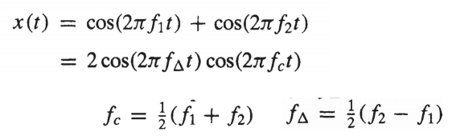

Where $f_\Delta$ and $f_c$ are the frequencies of the sinusoids that are multiplied (modulated) together, whereas $f_1$ and $f_2$ are the frequencies of the equivalent sum of sinusoids.

## Operations on Spectrum

### Addition

Adding a new signal to a spectrum just means adding all the sinusoids from the new signal to the old one, so adding new lines to the plot without changing the existing ones, with on exception. If the frequency is already in the spectrum, adding a sinusoid with the same frequency means you have to calculate the phase and amplitude again, see Chapter 1 regneregler.

### Scaling

Scaling a frequency in the input scales the frequency in the spectrum representation the same amount. The same applies to amplitude and phase.

# 3. Sampling, Aliasing, Shannon, Nyquist

Sampling continuous function into an array of evenly spaced discrete measurements, called *samples.*

$x[n] = x(nT_s)$

Where:

* $$n\in (-\infty, \infty)$$: is an integer index
* $T_s$: sampling period, i.e. time between each measurement
* $f_s=1/T_s$: sampling frequency.

Normalized radian frequency:

$\hat\omega=\omega T_s$

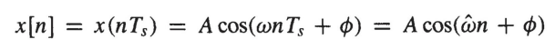

## Shannon / Nyquist

If a signal is sampled at a frequency $f_s$, the highest frequency signal which can be reconstructed without loss of information is at a frequency of $f_s/2$.

Nyquist frequency/ Nyquist limit: $f_s/2$

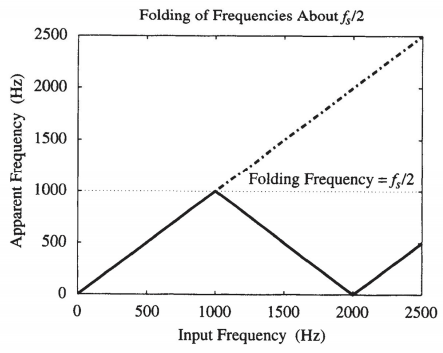

## Digital to Continuous

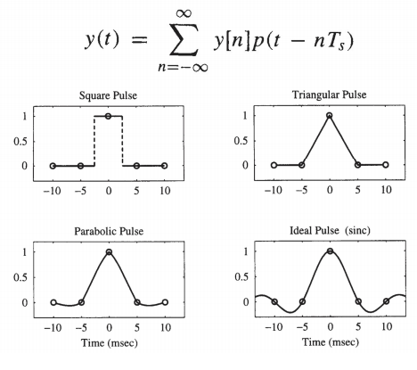

### Square Pulse Interpolation

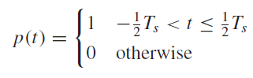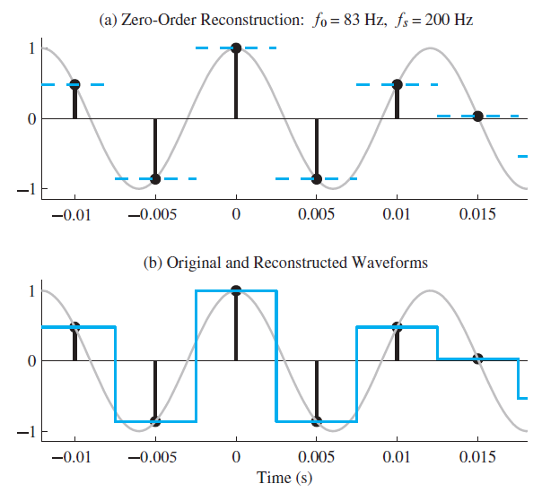

### Linear Interpolation

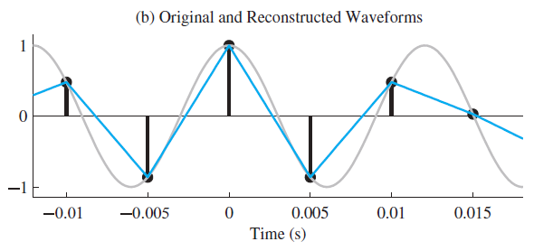

### Cubic Spline Interpolation

Probably not in exam, if it is and you are reading this now during exam then good luck.

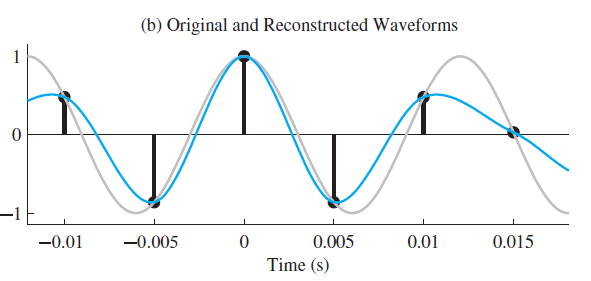

### Sinc Interpolation

Sinc is the ideal interpolation, but it requires infinite samples so it's not possible in reality.

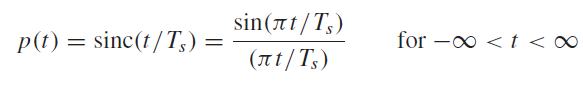

# 
