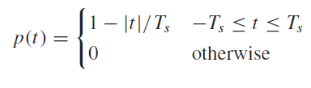
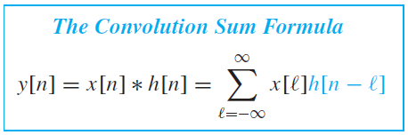

[TOC]

# 1. Sinusoids

$$x(t) = A\cdot\cos(\omega_0 t + \varphi) = A\cos(2\pi f_0 t + \varphi)$$

where:

* $$A$$ is amplitude
* $\varphi$ is phase shift, is in radians, not seconds, i.e. time shift relative to the frequency.
* $\omega_0$ is the radian frequency (radians per second)
* $f_0 = \omega_0/(2 \pi)$ is the cyclic frequency (normal nice intuitive frequency)

## Period vs. Frequency

$$T_0=\dfrac{1}{f_0}=\dfrac{2\pi}{\omega_0}$$

Where $T_0$ is the *period* of the oscillation, i.e. how long it takes for a single cycle of oscillation, start to finish, whereas $f_0$ is how many oscillations per second.

## Time-Shift vs. Phase-Shift

Phase shift is relative to frequency and is in radians, time shift is absolute and is in seconds.

$$x(t - t_0) = A\cdot\cos(\omega_0 (t - t_0) + \varphi)$$

Where:

* $t_0$: time shift
* $\varphi$: phase shift
* Everything else explained above

## Complex Exponential Form

Complex exponentials are basically vectors that spin around the origin. The x and y coordinates are a sine and cosine function, so sinusoids can be re-written as complex exponentials.

$$A e^{j(\omega_0 t+\varphi)} = A\cos(\omega_0 t + \varphi) + jA\sin(\omega_0 t + \varphi)$$

$$\Re\{A e^{j(\omega_0 t+\varphi)}\} = A\cos(\omega_0 t + \varphi)$$

### Regneregler

TODO: rewrite this section with an in-depth step by step, see exercise 2.11

$$\cos\theta = \dfrac{e^{j\theta} + e^{-j\theta}}{2}$$

$$\sin\theta =\dfrac{e^{j\theta}-e^{-j\theta}}{2j}$$

Sum of sinusoids with the same frequency, but different phases or amplitudes, is a new sinusoid with the same frequency but different amplitude and phase.

$$\cos(...) + \cos(...) + ...$$ (where they have the same frequency but not the same amplitude or phase)

$$\sum A_ke^{j\phi_k} = Ae^{j\phi}$$

$$\Re\{Ae^{j\phi}e^{j\omega_0 t}\}=\cos(...)$$

If you need to sum a bunch of sinusoids that have the same frequency, just transform them to polar form, add them together, multiply the result by $e^{j\omega_0 t}$ and take the real part and that's the sum.

# 2. Spectrum Representation

Sum of sinusoids, where amplitude, phase and frequency can all freely be changed, can theoretically represent any continuous signal (but might require an infinite sum).


Taking the real component of a sum of complex exponentials, is the same as adding the complex conjugates of each term to the terms, which cancels out the imaginary part. This means that the spectrum has a mirrored negative frequency side which is derived from the complex conjugates.


**To solve exercises:** re-write whatever function you have to find the spectrum of into a sum of sinusoids, by first transforming it into complex exponential form, then rearranging the terms and using properties of exponentials to get a sum of complex exponentials, then converting back into a sum of sinusoids.

## Amplitude Modulation

Instead of doing the whole calculations by hand, use these formulas


Where $f_\Delta$ and $f_c$ are the frequencies of the sinusoids that are multiplied (modulated) together, whereas $f_1$ and $f_2$ are the frequencies of the equivalent sum of sinusoids.

## Operations on Spectrum

### Addition

Adding a new signal to a spectrum just means adding all the sinusoids from the new signal to the old one, so adding new lines to the plot without changing the existing ones, with on exception. If the frequency is already in the spectrum, adding a sinusoid with the same frequency means you have to calculate the phase and amplitude again, see Chapter 1 regneregler.

### Scaling

Scaling a frequency in the input scales the frequency in the spectrum representation the same amount. The same applies to amplitude and phase.

# 3. Sampling, Aliasing, Shannon, Nyquist

Sampling continuous function into an array of evenly spaced discrete measurements, called *samples.*

$x[n] = x(nT_s)$

Where:

* $$n\in (-\infty, \infty)$$: is an integer index
* $T_s$: sampling period, i.e. time between each measurement
* $f_s=1/T_s$: sampling frequency.

Normalized radian frequency:

$\hat\omega=\omega T_s$


## Shannon / Nyquist

If a signal is sampled at a frequency $f_s$, the highest frequency signal which can be reconstructed without loss of information is at a frequency of $f_s/2$.

Nyquist frequency/ Nyquist limit: $f_s/2$


### Magic Formula of Aliasing


## Digital to Continuous


### Square Pulse Interpolation


### Linear Interpolation




### Cubic Spline Interpolation

Probably not in exam, if it is and you are reading this now during exam then good luck.


### Sinc Interpolation

Sinc is the ideal interpolation, but it requires infinite samples so it's not possible in reality.


# 4 & 5. Finite Impulse Response (FIR) Filters

A FIR filter is basically:

* A rolling average where we can freely choose the weights of the inputs.
* A convolution of the input signal with the filter impulse response.

$y[n]=\displaystyle\sum_k^M b_kx[n-k]$

Where :

* $M$ is the size of the filter window.
* $b$ is an array of weights.

## Impulse Response

The impulse response of a system is:

$\delta[n]\Rightarrow\text{system}\Rightarrow h[n]$

Where $\delta$ is the unit impulse function: $\begin{cases}1\quad n=0\\0\quad n\neq0\end{cases}$

So the impulse response of a FIR filter is:

$h[n]=\displaystyle\sum_k^M b_k\delta[n-k]$

## Convolution

If you have the impulse response of a system, you can filter a signal by taking the convolution:

$y[n]=x[n]*h[n]$

 

For a finite impulse response of size $M$, the convolution is the same as the definition of FIR filters. I.e.:

$y[n]=x[n]*h[n]=\displaystyle\sum_k^M x[n]h[n-k]=\sum_k^M b_kx[n-k]$

If the window or the signal are not infinite, the sum will also not be infinite. So it can in general be done.7


## Frequency Response

For an arbitrary discrete sinusoid input $x$, the response of the filter is:

$x[n]=Ae^{j\phi}e^{j\hat\omega n}$

$\begin{aligned}y[n]&=\displaystyle\sum_k^M b_k Ae^{j\phi}e^{j\hat\omega (n-k)}\\&=\left(\sum_k^M b_k e^{j\hat\omega k}\right)Ae^{j\phi}e^{j\hat\omega n}\\&=\mathcal H(\hat\omega)Ae^{j\phi}e^{j\hat\omega n}\end{aligned} $

This gives a formula for the response of the filter to a small set of frequencies:

$\mathcal H(\hat\omega)=\displaystyle\sum_k^M b_k e^{j\hat\omega k}$

## Regneregler

Superposition:

$\mathcal H_3 = a\mathcal H_1 + b\mathcal H_2$

Adding or scaling two frequency responses together gives a new frequency response, i.e. they are a linear combination.

## Difference Equations

This is a difference equation:

$y[n]=x[n] + x[n-1]$

This is also a difference equation:

$y[n]=x[n] - y[n - 1]$

So a FIR filter with weights: $b=(1, 0.5, 0.33, 0.25)$

$y[n] = b_0x[n-3]+b_1x[n-2]+b_2x[n-1]+b_3x[n]$

$y[n]=x[n-3]+0.5x[n-2]+0.33x[n-1]+0.25x[n]$

 ## Cascaded FIR Filters


# 6. Discrete-Time Fourier Transform (DTFT)

Generalizing the concept of frequency response, we get the Discrete Time Fourier Transform (DTFT) which allows us to take the frequency spectrum of any signal, with the constraint that the signal needs to be infinite, so the DTFT is only computable analytically.

$\mathcal H(\hat\omega) = frequency\_response\{h[n]\}=\displaystyle\sum_k^M h[n]e^{-j\hat\omega k}$

$\Downarrow$ generalizes to

$X(\hat\omega)=DTFT\{x[n]\}=\displaystyle\sum_{n=-\infty}^\infty x[n]e^{-j\hat\omega n}$

## Inverse DTFT

$x[n] = IDTFT\{X(\hat\omega)\}=\dfrac{1}{2\pi}\displaystyle\int_{-\pi}^\pi X(\hat\omega)e^{j\hat\omega n}d\hat\omega$

## Common DTFT Table

TODO

## Properties of DTFT Table

| Name of Property | Time-domain               | Frequency-domain                    |
| ---------------- | ------------------------- | ----------------------------------- |
| Linearity        | $ax_1[n]+bx_2[n]$         | $aX_1(\hat\omega)+bX_2(\hat\omega)$ |
| Time delay       | $x[n-n_d]$                | $X(\hat\omega)e^{-j\hat\omega n_d}$ |
| Frequency shift  | $e^{j\hat\omega_0 n}h[n]$ | $X(\hat\omega - \hat\omega_0)$      |
| Convolution      | $x[n]*h[n]$               | $X(\hat\omega)H(\hat\omega)$        |

## Energy of a Signal

$energy=\displaystyle\sum_{-\infty}^\infty x[n]^2=\dfrac{1}{2\pi}\int_{-\pi}^\pi |X(\hat\omega)|^2 d\hat\omega$

## Ideal Filters

Ideal low-pass:

$\mathcal H_{lp}(\hat\omega)=\begin{cases}1\quad|\hat\omega|\leq\hat\omega_{cut}\\0\quad\hat\omega_{cut}<|\hat\omega_{cut}|\leq\pi\end{cases}$

$h_{lp}[n]=IDTFT\{\mathcal H_{lp}(\hat\omega)\}=\dfrac{\sin(\hat\omega_{cut}n)}{\pi n}\quad-\infty<n<\infty$

This is very similar to the sinc function.

Ideal high-pass:

$\mathcal H_{hp}(\hat\omega)=\begin{cases}0\quad|\hat\omega|\leq\hat\omega_{cut}\\1\quad\hat\omega_{cut}<|\hat\omega_{cut}|\leq\pi\end{cases}$

$h_{hp}[n]=IDTFT\{\mathcal H_{hp}(\hat\omega)\}=\delta[n]-h_{lp}[n]=\delta[n]-\dfrac{\sin(\hat\omega_{cut}n)}{\pi n}\quad-\infty<n<\infty$

# 7. Discrete Fourier Transform (DFT) & Fast Fourier Transform (FFT)

We can take the Fourier transform of a finite signal by discretizing the frequency spectrum. This gives us the Discrete Fourier Transform (DFT).

$X[k]=DFT\{x[n]\}\displaystyle=\sum_{n=0}^{N-1}x[n]e^{-j(2\pi/N)kn}$

 Where:

$k \in [0,N-1]$

I.e. for a finite signal of size $N$, the DFT produces a spectrum of size $N$. The entries in the spectrum are called "bins". They are complex numbers, where the magnitude of the number is the amplitude of that frequency, and the angle is the phase.

The bigger the signal, the more fine-grained the frequency spectrum becomes, this is a practical example of the *Heisenberg uncertainty principle.*

## Inverse DFT

$x[n]=IDFT\{X[k]\}=\displaystyle\dfrac{1}{N}\sum_{n=0}^{N-1}x[n]e^{j(2\pi/N)kn}$

Notice how the formula for the inverse DFT is almost identical to the normal DFT.

## Table of Common DFTs

TODO

## Fast Fourier Transform (FFT)

The naïve DFT has a time complexity of $\mathcal O(N^2)$, a better algorithm called the Fast Fourier Transform has time complexity $\mathcal O(N\log N)$.

Notably, the FFT only works if $N$ is a power of 2, i.e. $log_2N\in\N$

The algorithm is recursive:

* Base case: size of the input array is 2, DFT is trivial.

  

* Recursive case: perform the DFT of the vector formed by all the even entries and the vector formed by all the odd entries (recursively), then combine them (see pseudocode)

```python
# x is an array of floating point numbers, with a size that is a power of 2
def fft(x):
    # instantiate the output array, with the same size as the input
    X = [0.0] * len(x)
    
    # base case: the array is of size 2, then the DFT is trivial
    if len(x) == 2:
    	X[0] = x[0] + x[1]
        X[1] = x[0] - x[1]
        return X
    
    # recursive case: take the DFT of the arrays formed by the odd terms and the even
    # terms, and combine them together
    else:
        fft_even = fft(x[0::2])  # the [0::2] slice operator takes every other entry
        					     # starting from 0, so all the even entries: 0, 2, 4 ...
        fft_odd  = fft(x[1::2])  # the [1::2] slice operator takes every other entry
        						 # starting from 1, so all the odd entries: 1, 3, 5 ...
            
        # iterate over output array
        for k in range(len(x)//2):
            # first half of output:
            X[k]             = fft_even[k] + fft_odd[k] * exp(-2j*pi*k/N)
            # second half of the output
         	x[k + len(x)//2] = fft_even[k] - fft_odd[k] * exp(-2j*pi*k/N)
        return X
        
```

For an 8-point DFT, the algorithm can be summarized by this block diagram:


The inverse FFT (IFFT) is almost identical, the only differences are: that the sign of `j` in the the `exp(2j*pi*k/N)` term is flipped (so `exp(2j*pi*k/N)` instead `exp(-2j*pi*k/N)`); and that each entry of the output vector is divided by $N$ at the end.

# 8. Z-Transform

The z-transform transforms a vector $x$ into a complex polynomial $p(z)$. Every sample in $x$ becomes a coefficient of a term of the polynomial. The exponent of the term is a negative number, which is the negative of the index of the input vector its coefficient is taken from:

$X(z) =\displaystyle\sum_{n=0}^{N-1} x[n]z^{-n}$

Or the generalized form, for an infinite signal $x$:

$X(z)=\displaystyle\sum_{n=-\infty}^\infty x[n]z^{-n}$

Example:

$\begin{matrix}( & 1 & 2 & 3 & 5 & 8 & )\\ &\downarrow&\downarrow&\downarrow&\downarrow&\downarrow\\ &1 &+2z^{-1} &+3z^{-2} &+5z^{-3} &+8z^{-4}\end{matrix}$

## Z-Transform of Time Delay

z-transforms are useful because they describe time delays very easily.

This is a time delay by $d$ samples in time-domain:

$x[n]\to x[n-d]$

The same in z-domain:

$X(z)\to X(z)z^{-d}$

## Z-Transform of FIR Filters

$y[n]=\displaystyle\sum_{k=0}^M b_kx[n-k]$

$\Downarrow$

$Y(z)=\left(\displaystyle\sum_{k=0}^Mb_kz^{-k}\right)X(z)$

The part in parentheses is written as $H(z)$ and is called the system-function. 

## Z-Transform of IIR Filters

TODO

## Properties

| Property                  | n-domain          | z-domain          | $\hat\omega$-domain                 |
| ------------------------- | ----------------- | ----------------- | ----------------------------------- |
| Linearity (superposition) | $ax_1[n]+bx_2[n]$ | $aX_1(z)+bX_2(z)$ | $aX_1(\hat\omega)+bX_2(\hat\omega)$ |
| Time delay                | $x[n-n_0]$        | $z^{-n_0}X(z)$    | $e^{-j\hat\omega n_0}X(\hat\omega)$ |
| Convolution               | $h[n]*x[n]$       | $H(z)X(z)$        | $H(\hat\omega)X(\hat\omega)$        |

# 9 & 10. Infinite Impulse Response (IIR) Filters

IIR filters have feedback, i.e. their difference equation contains references to the output of the function, i.e. it's a form of discrete differential equation:

$y[n]=\displaystyle\sum_{l=1}^{N}a_ly[n-l]+\sum_{k=0}^Mb_kx[n-k]$

This is the **general differential equation** you have two sums: previous outputs and previous inputs, multiplied with some coefficients. In this case our signal $x$ and the output $y$ are assumed to be 0 for negative times, i.e. we start the computation at index 0, and whenever we go out of bounds, i.e. have a negative index, we assume the value is 0.

If we take the z-transform we get:

$Y(z)=X(z)H(z)=X(z)\dfrac{b_0 + b_1z^{-1}+ b_2z^{-2} + \dots}{1 - a_1z^{-1} - a_2z^{-2}-\dots}$

The roots of the **numerator** are called **zeros**

The roots of the **denominator** are called **poles**

Because IIR filters have a feedback path in them, they decay exponentially and their impulse response approaches 0 asymptotically, but only reaches 0 after infinite time, therefore they are called infinite impulse response filters (IIR)

## Stability

In order to be stable the following condition must be satisfied:

$\left|\displaystyle\sum_0^\infty h[n]\right|<\infty$

Same condition in z-domain is that all poles must be contained within the disc described by the unit circle.

## Block Diagrams

This is a block diagram for a difference equation:


**Imagine that the blocks that have a T in them, have a $z^{-1}$ in them instead. I couldn't find a good picture** 

Sometimes it is represented in this more compact form, they are equivalent. This form cuts down on the number of delay operations, but is harder to read.


## Frequency Response From z-domain

From z-domain system function:

$H(z) = \dfrac{b_0+b_1z^{-1}+\dots}{1 - a_1z^{-1} - \dots}$

Then insert $z = e^{j\hat\omega}$ to get the frequency and phase response, i.e. the complex frequency response:

$H(\hat\omega)=\dfrac{b_0+b_1e^{-j\hat\omega}+\dots}{1-a_1e^{-j\hat\omega}-\dots}$

Then you have to find the following:

* (real) frequency response: $|H(\hat\omega)|$
* phase response: $\angle H(\hat\omega)$

### Frequency and Phase Response of 1st Order Filters

$|H(\hat\omega)|^2=\dfrac{|b_0|^2+|b_1|^2+2b_0b_1\cos(\hat\omega)}{1+|a_1|^2-2a_1\cos(\hat\omega)}$

$\angle H(\hat\omega) = atan\left(\dfrac{-b_1\sin(\hat\omega)}{b_0+b_1\cos(\hat\omega)}\right)-atan\left(\dfrac{a_1\sin(\hat\omega)}{1-a_1\cos(\hat\omega)}\right)$

### Frequency and Phase Response of 2nd Order Filters

It's so unintuitive that you should just use Matlab (TODO)

## Design by Poles And Zeros

* *zero*: placing a zero **on** the unit circle, forces the frequencies at $\hat\omega=\angle zero$ to be 0, and frequencies nearby to become quieter. This can be used for wide band-stop filters.
* *pole*: placing a pole **near** but not on the unit circle, boosts the frequencies at $\hat\omega=\angle pole$ and the nearby frequencies to a lesser degree. This can be used for wide band-pass or peaking filters.

Then you take the inverse z-transform:

$\begin{aligned}H(z)&=\dfrac{(s_1-z^{-1})(s_2-z^{-1})}{(1-p_1z^{-1})(1-p_2z^{-1})}\\&=\dfrac{b_0+b_1z^{-1}+b_2z^{-2}}{1-a_1z^{-1}-a_2z^{-2}}\\y[n]&=b_0x[n]+b_1x[n-1]+b_2x[n-2]-a_1y[n-1]-a_2y[n-2]\\h[n]&=b_0\delta[n]+b_1\delta[n-1]+b_2\delta[n-2]-a_1h[n-1]-a_2h[n-2]\end{aligned}$

Notice that the book really likes to put negative signs on the $a$ coefficients, but like depends if you prefer to make it explicit that the $a$ coefficients are negative. Doesn't really matter.

### Closed-Form of IIR Impulse Response in n-domain

Do the inverse z-transform, this time using the tables of basic transforms and partial fraction expansion. This allows you to define the impulse response as a function without recursion:

First you find the zeros and poles, if you don't know them already:

$\begin{aligned}H(z)&=\dfrac{b_0+b_1z^{-1}+b_2z^{-2}+b_3z^{-3}}{1-a_1z^{-1}-a_2z^{-2}}\\&=\dfrac{(s_1-z^{-1})(s_2-z^{-1})(s_3-z^{-1})}{(1-p_1z^{-1})(1-p_2z^{-1})}\end{aligned}$

Then you need to do partial fraction expansion, by using an illuminati operation:

$H(z)=\dfrac{A}{1-p_1z^{-1}}+\dfrac{B}{1-p_2z^{-1}}+C$

Now because of the superposition property of z-transforms, you can do the inverse z-transform on each by consulting a table:

$h[n]=A(p_1^n)u[n]+B(p_2^n)u[n]+C\delta[n]$

# Appendix A - Mat C,B,A Regneregler

TODO


